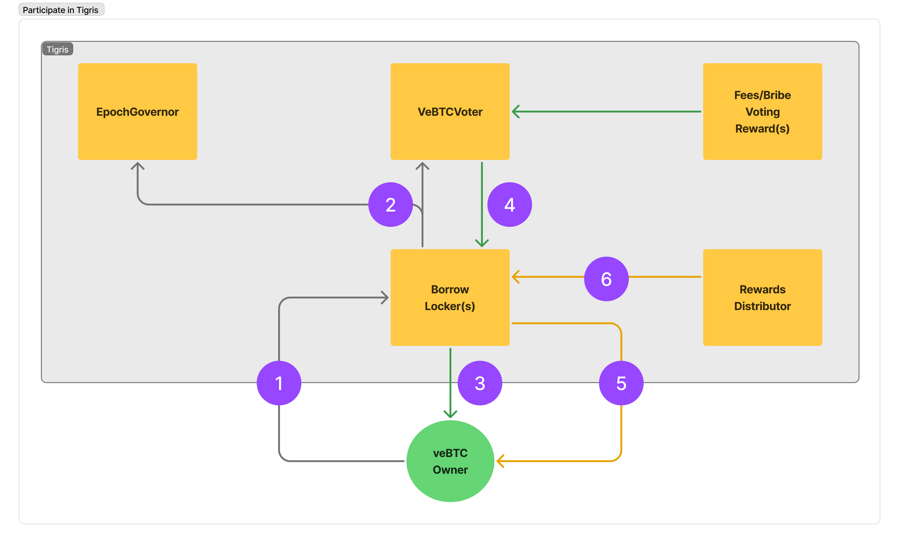

# RFC-1: Using veBTC as mUSD collateral

## Background

Holders of liquid BTC have two primary paths to utilize it on the Mezo chain:

- Lock BTC in a veBTC NFT to participate in [Tigris], the incentive system for Mezo.
  Holders of veBTC receive voting power and earn rewards and fee shares.
- Use BTC as collateral to borrow the [mUSD] stablecoin.

Currently, these paths are mutually exclusive, forcing holders to choose between them.
This RFC proposes a solution to combine both options by enabling the use of veBTC as collateral for mUSD.

### Current functionality

#### veBTC overview

To lock BTC in a veBTC NFT, users must call the `createLock` function on the [VeBTC] contract.
The underlying BTC is locked for a specified duration, and the lock creator receives ownership of the
newly minted veBTC NFT.

The veBTC owner has the following capabilities:

- Voting:
  - Vote on swap pool gauges
  - Vote on the [ChainFeeSplitter]'s needle parameter, which determines
    how BTC rewards are distributed between pool gauges and veBTC holders
- Earning:
  - Earn a proportional share of swap fees from pools they voted for
  - Receive a portion of BTC rewards specifically allocated to veBTC holders
- Management:
  - Extend the lock duration
  - Increase the amount of locked BTC
  - Transfer veBTC ownership to another address
  - Withdraw the underlying BTC after the lock expires

The veBTC owner cannot access or use the underlying locked BTC in any way, as it remains fully controlled
by the veBTC contract until the lock expires.

#### mUSD overview

To borrow mUSD against BTC, users must call the `openTrove` function on the [BorrowerOperations] contract.
Since the function is `payable`, users need to include the appropriate amount of liquid BTC with their transaction.
Upon execution, the BTC is transferred to the [ActivePool] contract as collateral, mUSD is minted,
and the caller becomes the borrower controlling the newly opened trove. Each borrower is limited to one active trove at a time.

The trove owner has the following capabilities:

- Borrow additional mUSD against their existing trove
- Add more BTC collateral to increase their collateral ratio
- Withdraw excess BTC collateral while maintaining required ratios
- Refinance their trove to align with the current global interest rate
- Close their trove by fully repaying the borrowed mUSD

Additionally, troves are subject to:

- Redemptions by other users
- Liquidation events resulting in collateral seizure

It's worth noting that all trove operations can be executed either through regular transactions or via gasless
EIP-712 signatures (implemented in the [BorrowerOperationsSignatures] contract).

The mUSD protocol is currently designed to only accept the chain's native token as collateral. On Mezo,
this means liquid BTC. The protocol does not support using other assets as collateral.

## Proposal

This RFC proposes a functionality that enables users to utilize veBTC as collateral for mUSD borrowing.
The solution preserves the voting and earning capabilities of veBTC owners while remaining transparent
to the mUSD protocol.

### Goal

The goal of this proposal is to eliminate the current trade-off where users must choose between locking
BTC for protocol governance and fees/rewards, or using it as collateral for mUSD loans. By enabling both
use cases simultaneously, users can maximize the utility and benefits of their BTC position.

### Implementation

To achieve this goal, this RFC proposes a new contract called `BorrowLocker` with the following key
responsibilities:

- Taking ownership of specific veBTC collateral
- Interacting with the mUSD protocol on behalf of veBTC owners (using EIP-712 signatures)
- Managing BTC settlement between Tigris and mUSD protocols
- Returning veBTC to owners when troves are closed
- Managing veBTC takeovers during liquidation events
- Preserving Tigris voting and earning capabilities for veBTC owners

The `BorrowLocker` contract is designed to be deployed individually for each veBTC token used
as collateral. This design choice is primarily driven by Tigris's rewards/fees distribution mechanism,
where BTC rewards and swap fees are sent directly to veBTC owners via standard ERC20 transfers.
A singleton `BorrowLocker` contract controlling multiple veBTC tokens would make it impossible to
correctly distribute rewards and fees among different veBTC owners. Additionally, having a single
`BorrowLocker` contract would introduce significant centralization risk by concentrating the voting
power of all locked veBTC collateral in one place. The per-token deployment model ensures proper
separation of voting power and reward distribution.

The deployment and lifecycle management of `BorrowLocker` contracts is meant to be handled by a
new contract called `BorrowLockerFactory`. This factory contract has three core responsibilities:

- Creating new `BorrowLocker` instances and initiating the borrow process when a veBTC token is received
- Retrieving underlying BTC from the veBTC NFT and transferring it to the appropriate `BorrowLocker` contract
- Maintaining a registry of all `BorrowLocker` instances and their current states

It's important to note that the `VeBTC` contract currently lacks functionality to enable BTC retrieval
by the `BorrowLockerFactory`. This critical capability will have to be implemented as part of this proposal.

The following sections provide detailed walkthroughs of key interactions with the `BorrowLocker` and
`BorrowLockerFactory` contracts, illustrating the complete lifecycle of veBTC-collateralized loans.

#### Borrow mUSD against veBTC

The following diagram illustrates the key interactions between the proposed contracts and existing
Tigris/mUSD components when a veBTC owner initiates a borrow against their veBTC collateral:

1. The process begins when a veBTC owner initiates a transfer of their veBTC NFT to the
   `BorrowLockerFactory` contract using the `safeTransferFrom` function of the `VeBTC`
   contract. This function supports passing additional data as part of the transfer, which
   is used to include the call data needed by the `openTroveWithSignature` function of the
   `BorrowerOperationsSignatures` contract. This allows the trove to be opened atomically in
   the same transaction as the NFT transfer.
2. When the veBTC NFT is transferred, the `VeBTC` contract triggers the `onERC721Received` hook on
   the `BorrowLockerFactory` contract (which implements `IERC721Receiver`). Upon receiving the NFT,
   the `BorrowLockerFactory` makes a callback to the `VeBTC` contract to retrieve the underlying BTC
   tokens through the new special retrieval path.
3. The `BorrowLockerFactory` contract deploys a dedicated `BorrowLocker` contract for the veBTC NFT,
   initializing it with both the retrieved BTC and the `openTroveWithSignature` call data. The
   original veBTC NFT owner retains control as the owner of this new `BorrowLocker` contract.
4. The `BorrowLocker` contract calls `openTroveWithSignature` on `BorrowerOperationsSignatures`,
   providing the obtained call data and a portion of liquid BTC retrieved from the veBTC as collateral.
   The portion is computed with respect to the `maxAllowedNFTUtilization` parameter.
5. The `BorrowerOperationsSignatures` contract verifies the signature and passes control to the
   `BorrowerOperations` contract to open the trove.
6. The `BorrowerOperations` contract opens the trove and mints the requested amount of mUSD.
   The BTC collateral is put aside in the `ActivePool` contract.
7. The minted mUSD is transferred to the veBTC owner.

Important considerations and notes regarding this section:

- The initial `safeTransferFrom` call can be executed either directly by the veBTC owner or through a
  gasless transaction using the GSN-compatible [MezoForwarder] contract.
- The code assembling `openTroveWithSignature` call data must accurately determine the upper/lower hints
  for the sorted trove insertion to avoid excessive gas costs of `openTrove`.
- The code assembling `openTroveWithSignature` call data must precisely determine the amount of liquid
  BTC that will be used as collateral, with respect to the `BorrowLockerFactory`'s allowed collateral
  percentage. This is necessary to ensure proper signature verification by the `BorrowerOperationsSignatures`
  contract.
- The `onERC721Received` hook of the `BorrowLockerFactory` must only accept calls from the `VeBTC` contract
  to prevent unauthorized transfers.
- The special BTC retrieval path exposed by the `VeBTC` contract must be restricted to the `BorrowLockerFactory`
  and only for veBTC tokens it owns.
- This RFC does not force any particular logic of `BorrowLocker` creation. Naive deployment of `BorrowLocker`
  using the `new` keyword may be costly in terms of gas. Using the clone factory pattern may be a good alternative.
- It's crucial that the original veBTC owner retains control over the `BorrowLocker` contract.
  This allows the veBTC owner to continue participating in the `Tigris` protocol indirectly through
  the `BorrowLocker` contract. That implies the `BorrowLocker` contract must provide the necessary
  interface to do so.
- The `maxAllowedNFTUtilization` should be a governable parameter of the `BorrowLockerFactory`.
- Before opening the trove, the `BorrowLocker` contract must verify that its owner address matches the
  borrower address in the `openTroveWithSignature` call data to ensure proper trove attribution in mUSD.
- The original veBTC owner becomes the borrower controlling the newly opened trove. That said, trove
  management actions (depositing extra collateral, withdrawing excess collateral, etc.) can be perfomed
  only by the veBTC owner directly and are out of scope for the `BorrowLocker` contract.
- Given the fact that veBTC owner can execute trove manegement actions beyond the `BorrowLocker` contract,
  the `BorrowLocker` contract must track the trove state and ensure all edge cases are handled correctly so
  there is no way the custodied veBTC token remains locked indefinitely.

#### Participate in Tigris

The following diagram illustrates the key interactions between the proposed contracts and existing
Tigris components when a veBTC owner votes and earns rewards/fees in the Tigris protocol:

1. The veBTC owner can continue voting through the `BorrowLocker` contract, which provides methods for both
   gauge voting and adjusting the `ChainFeeSplitter`'s needle parameter.
2. The `BorrowLocker` contract forwards these votes to the `VeBTCVoter` and `EpochGovernor` contracts. As
   the current owner of the veBTC token, the `BorrowLocker` has the necessary permissions to execute these
   voting actions.
3. The veBTC owner can claim earned swap fees from pools they voted for by calling a dedicated method on the
   `BorrowLocker` contract.
4. The `BorrowLocker` contract forwards the claim request to the `VeBTCVoter` contract, which redirects
   the request to respective `FeesVotingRewards` and `BribeVotingRewards` contracts. As the current owner
   of the veBTC token, the `BorrowLocker` has the necessary permissions to execute these claim actions.
5. The veBTC owner can claim their share of BTC rewards by calling a dedicated method on the
   `BorrowLocker` contract.
6. The `BorrowLocker` contract forwards the claim request to the `RewardsDistributor` contract. Since claiming
   rewards is unrestricted, any address can trigger this action. For unexpired veBTC locks, the claimed BTC
   rewards automatically increase the locked BTC amount in the veBTC token. For expired locks, the BTC rewards
   are sent to the `BorrowLocker` contract as the current veBTC token owner.

Important considerations and notes regarding this section:

- The voting methods exposed by the `BorrowLocker` contract must be restricted to the veBTC owner.
- The claim methods exposed by the `BorrowLocker` contract do not have to be restricted but must
  ensure claimed rewards/fees are transferred to the veBTC owner.

#### Repay mUSD loan and withdraw veBTC

The following diagram illustrates the key interactions between the proposed contracts and existing
Tigris/mUSD components when a veBTC owner repays their mUSD loan and withdraws their veBTC collateral:

1. The veBTC owner prepares a `closeTroveWithSignature` transaction by constructing call data that specifies
   the `BorrowLocker` contract as the recipient of the released BTC collateral. This transaction can be
   submitted directly or via a relayer to the `BorrowerOperationsSignatures` contract.
2. Upon receiving the transaction, the `BorrowerOperationsSignatures` contract validates the signature and
   delegates execution to the `BorrowerOperations` contract.
3. The `BorrowerOperations` contract closes the trove and initiates mUSD burning.
4. The corresponding amount of mUSD is burned from the veBTC owner's balance.
5. The released BTC collateral is transferred to the `BorrowLocker` contract.
6. The veBTC owner may be required to deposit additional BTC to cover any collateral shortfall in the
   `BorrowLocker` contract, particularly if their trove was previously subject to redemptions by other users.
7. The `BorrowLocker` transfers the BTC collateral to the `BorrowLockerFactory` contract, signaling the completion
   of its lifecycle and preventing any further operations.
8. The `BorrowLockerFactory` contract transfers the BTC back to the `VeBTC` contract to repay the BTC debt
   associated with the given veBTC NFT that was created during the initial borrowing process.
9. The original veBTC owner regains ownership of the veBTC NFT.

Important considerations and notes regarding this section:

- The flow described above leverages EIP-712 signatures for trove closure, which represents the most
  gas-efficient approach by minimizing the number of required transactions. However, alternative methods
  are also possible - for instance, the veBTC owner could opt to directly invoke the `closeTrove` function
  on the `BorrowerOperations` contract and subsequently transfer the withdrawn BTC collateral to the
  `BorrowLocker` contract.
- The `BorrowLocker` may expose a `receive` method to handle incoming BTC transfers and automatically
  trigger subsequent actions (BTC settlement, veBTC ownership transfer) if the required amount of
  BTC is under `BorrowLocker`'s control.
- Before transferring veBTC ownership back to the original owner, the `BorrowLocker` contract must verify that
  the trove closure resulted from either loan repayment or redemption. In cases where the trove was closed due
  to liquidation, ownership transfer follows a separate process outlined in the
  [Liquidate mUSD loan and seize veBTC](#liquidate-musd-loan-and-seize-vebtc) section.
- The `BorrowLockerFactory` must ensure the `BorrowLocker` contract is not reused after it has been
  closed.
- The `BorrowLocker` contract must provide a mechanism to claim any uncollected rewards and fees from its
  balance, even after closure.

#### Liquidate mUSD loan and seize veBTC

The following diagram illustrates the key interactions between the proposed contracts and existing
Tigris/mUSD components when a third-party liquidator liquidates a mUSD loan and seizes the veBTC collateral:

1. The liquidator initiates the liquidation process by calling the `liquidate` method on the [TroveManager]
   As a result, the mUSD protocol seizes the BTC collateral and marks the trove as `closedByLiquidation`.
2. To acquire the veBTC NFT, the liquidator must deposit sufficient BTC into the `BorrowLocker` to cover
   the liquidated amount. Upon successful deposit, the liquidator gains control of the `BorrowLocker` contract
   and the underlying veBTC NFT at a discount.
3. The `BorrowLocker` transfers the BTC collateral to the `BorrowLockerFactory` contract, signaling
   the completion of its lifecycle and preventing any further operations.
4. The `BorrowLockerFactory` contract transfers the BTC back to the `VeBTC` contract to repay the BTC debt
   associated with the given veBTC NFT that was created during the initial borrowing process.
5. The liquidator gains ownership of the veBTC NFT.

Important considerations and notes regarding this section:

- The `BorrowLocker` contract must verify that trove closure occurred through liquidation before transferring
  veBTC ownership to the liquidator. This verification is critical as liquidation represents the only scenario
  where veBTC ownership can be transferred to a party other than the original owner.
- To protect borrowers, the `BorrowLocker` contract may implement a grace period mechanism. During this period,
  the original veBTC owner could have precedence to reclaim their veBTC by depositing the liquidated BTC amount
  into the `BorrowLocker` contract.
- Upon claiming ownership of the `BorrowLocker` contract, the liquidator automatically inherits all rights to
  uncollected rewards and fees accumulated within the contract.

### Limitations

_Under construction._

## Related Links

- [Tigris]: The incentive system for Mezo.
- [mUSD]: The BTC-backed stablecoin on Mezo.
- [VeBTC]: The veBTC NFT contract.
- [ChainFeeSplitter]: Contract distributing BTC rewards between gauges and veBTC holders.
- [BorrowerOperations]: Contract managing mUSD borrows.
- [ActivePool]: Contract holding the BTC collateral of active troves.
- [BorrowerOperationsSignatures]: Contract managing gas-less EIP-712 signatures for borrower operations.
- [MezoForwarder]: A GSN-compatible contract for gasless transactions.
- [TroveManager]: Contract managing mUSD troves.

<!-- Links definitions -->

[Tigris]: https://blog.mezo.org/mezo-the-2025-roadmap/#3-tigris
[mUSD]: https://github.com/mezo-org/musd
[VeBTC]: https://github.com/mezo-org/mezodrome/blob/e5a24828e645474cb284a3f16c1272286f491bbc/solidity/contracts/VeBTC.sol
[ChainFeeSplitter]: https://github.com/mezo-org/mezodrome/blob/e5a24828e645474cb284a3f16c1272286f491bbc/solidity/contracts/ChainFeeSplitter.sol
[BorrowerOperations]: https://github.com/mezo-org/musd/blob/0c4b3e42c903e1a4602e473e6c1ddd446f20fc4e/solidity/contracts/BorrowerOperations.sol
[ActivePool]: https://github.com/mezo-org/musd/blob/0c4b3e42c903e1a4602e473e6c1ddd446f20fc4e/solidity/contracts/ActivePool.sol
[BorrowerOperationsSignatures]: https://github.com/mezo-org/musd/blob/0c4b3e42c903e1a4602e473e6c1ddd446f20fc4e/solidity/contracts/BorrowerOperationsSignatures.sol
[MezoForwarder]: https://github.com/mezo-org/mezodrome/blob/350acfa966b788272f7c6e9d9402c619c210b5c9/solidity/contracts/forwarder/MezoForwarder.sol
[TroveManager]: https://github.com/mezo-org/musd/blob/0c4b3e42c903e1a4602e473e6c1ddd446f20fc4e/solidity/contracts/TroveManager.sol
